# Harness Control Flow

This document describes the end-to-end control flow of the agentic harness in two synchronized formats: an ASCII diagram for plain-text readability, and a Mermaid diagram for rendered viewing. Both diagrams describe the same conceptual model.

**How to read the diagrams:**

- **Boxes/nodes** represent agent steps or pipeline stages.
- **Diamonds** represent gate verdicts that determine whether work continues, retries, or spawns follow-on runs.
- **Arrows** show control flow (solid) and data flow (dashed/annotated).
- **Loops** are organized by command-driven workflow families: Delivery pipeline, Product feedback, Maintenance, Restructure, and Doc/memory sync.
- **Data stores** (cylinders in Mermaid, bracketed labels in ASCII) represent durable surfaces that persist across runs.

---

## ASCII Control Flow Diagram

```
╔══════════════════════════════════════════════════════════════════════════════════╗
║                           HARNESS CONTROL FLOW                                 ║
╚══════════════════════════════════════════════════════════════════════════════════╝

Human Operator
  │
  ├── /run-delivery-pipeline ─────────────────────────────────┐
  ├── /run-product-feedback-loop ──────────────────────┐      │
  ├── /run-maintenance-pipeline ────────────────┐      │      │
  ├── /run-restructure-pipeline ─────────┐      │      │      │
  ├── /run-meta-doc-sync-all ─────┐      │      │      │      │
  ├── /run-verification-stack     │      │      │      │      │  ← enters VERIFICATION SUBSTAGE
  ├── /run-breaker-followup       │      │      │      │      │  ← enters BREAKER FOLLOW-ON
  └── SME & Spec utilities        │      │      │      │      │
      (research, PR desc, etc.)   │      │      │      │      │
                                  │      │      │      │      │
┄┄┄┄┄┄┄┄┄┄┄┄┄┄┄┄┄┄┄┄┄┄┄┄┄┄┄┄┄┄┄┄┼┄┄┄┄┄┄┼┄┄┄┄┄┄┼┄┄┄┄┄┄┼┄┄┄┄┄┄┼┄┄┄┄┄┄┄┄┄┄┄┄┄┄┄┄
                                  │      │      │      │      │
═══════════════════════════════════╪══════╪══════╪══════╪══════╪══════════════════
 LOOP 1: DELIVERY PIPELINE        │      │      │      │      │
═══════════════════════════════════╪══════╪══════╪══════╪══════╪══════════════════
                                  │      │      │      │      │
                                  │      │      │      │      ▼
                                  │      │      │      │  ┌───────────────────┐
                                  │      │      │      │  │ pipeline.py start │
                                  │      │      │      │  │ --mode delivery   │
                                  │      │      │      │  └────────┬──────────┘
                                  │      │      │      │           │
                                  │      │      │      │           ▼
                                  │      │      │      │  ┌───────────────────────┐
                                  │      │      │      │  │  Coord Delivery       │
                                  │      │      │      │  │  Supervisor           │
                                  │      │      │      │  │  → TASK.md, PLAN.md   │
                                  │      │      │      │  └────────┬──────────────┘
                                  │      │      │      │           │
                                  │      │      │      │           ▼
                                  │      │      │      │  ┌───────────────────────┐
                                  │      │      │      │  │  Dev Delivery Coder   │◄─── review
                                  │      │      │      │  │  → PATCH.diff         │     feedback
                                  │      │      │      │  └────────┬──────────────┘     loop
                                  │      │      │      │           │                     │
                                  │      │      │      │           ▼                     │
                                  │      │      │      │  ┌───────────────────────┐      │
                                  │      │      │      │  │  Test Delivery        │      │
                                  │      │      │      │  │  Reviewer             │──────┘
                                  │      │      │      │  │  → REVIEW_NOTES.md    │
                                  │      │      │      │  └────────┬──────────────┘
                                  │      │      │      │           │ APPROVE
                                  │      │      │      │           ▼
                                  │      │      │      │  ┌───────────────────────┐
                                  │      │      │      │  │  Spec Diff Planner    │
                                  │      │      │      │  │  → SECOND_PASS_PLAN   │
                                  │      │      │      │  └────────┬──────────────┘
                                  │      │      │      │           │
                                  │      │      │      │           ▼
                                  │      │      │      │  ┌───────────────────────┐
                                  │      │      │      │  │  Test Delivery QA     │
                                  │      │      │      │  │  → QA_REPORT.md       │
                                  │      │      │      │  └────────┬──────────────┘
                                  │      │      │      │           │
                                  │      │      │      │           ◇ PASS?
                                  │      │      │      │          ╱ ╲
                                  │      │      │      │    FAIL ╱   ╲ PASS
                                  │      │      │      │   ┌───╱     ╲───┐
                                  │      │      │      │   │remediate│   │
                                  │      │      │      │   │loop     │   ▼
                                  │      │      │      │   └─────────┘  ┌───────────────────────┐
                                  │      │      │      │                │  Test Delivery Broad   │
                                  │      │      │      │                │  Reviewer              │
                                  │      │      │      │                └────────┬───────────────┘
                                  │      │      │      │                         │
                                  │      │      │      │  ┄┄┄┄┄┄┄┄┄┄┄┄┄┄┄┄┄┄┄┄┄┄┼┄┄┄┄┄┄┄┄┄┄┄┄┄┄
                                  │      │      │      │  VERIFICATION SUBSTAGE  │
                                  │      │      │      │  ┄┄┄┄┄┄┄┄┄┄┄┄┄┄┄┄┄┄┄┄┄┄┼┄┄┄┄┄┄┄┄┄┄┄┄┄┄
                                  │      │      │      │                         ▼
                                  │      │      │      │                ┌───────────────────────┐
                                  │      │      │      │                │  pipeline.py           │
                                  │      │      │      │                │  diff/test/build/      │
                                  │      │      │      │                │  validate              │
                                  │      │      │      │                └────────┬───────────────┘
                                  │      │      │      │                         │
                                  │      │      │      │                         ▼
                                  │      │      │      │                ┌───────────────────────┐
                                  │      │      │      │                │  Test Build Verifier   │
                                  │      │      │      │                │  → BUILD_VERIFICATION  │
                                  │      │      │      │                └────────┬───────────────┘
                                  │      │      │      │                         │
                                  │      │      │      │                         ▼
                                  │      │      │      │                ┌───────────────────────┐
                                  │      │      │      │                │  Meta Bad State        │
                                  │      │      │      │                │  Monitor               │
                                  │      │      │      │                │  → BAD_STATE_REPORT    │
                                  │      │      │      │                └────────┬───────────────┘
                                  │      │      │      │                         │
                                  │      │      │      │                         ▼
                                  │      │      │      │                ┌──────────────────────────┐
                                  │      │      │      │                │  Coord Breaker            │
                                  │      │      │      │                │  Orchestrator             │
                                  │      │      │      │                │  ├─ Test Breaker Spec     │
                                  │      │      │      │                │  ├─ Test Breaker Tests    │
                                  │      │      │      │                │  └─ Test Breaker Security │
                                  │      │      │      │                │  → BREAKER_REPORT.md      │
                                  │      │      │      │                └────────┬─────────────────┘
                                  │      │      │      │                         │
                                  │      │      │      │                         ▼
                                  │      │      │      │                ┌───────────────────────┐
                                  │      │      │      │                │  Test Delivery         │
                                  │      │      │      │                │  Evaluator             │
                                  │      │      │      │                │  → EVAL_REPORT.json    │
                                  │      │      │      │                └────────┬───────────────┘
                                  │      │      │      │                         │
                                  │      │      │      │                         ▼
                                  │      │      │      │                ┌───────────────────────┐
                                  │      │      │      │                │  Test Regression       │
                                  │      │      │      │                │  Detector              │
                                  │      │      │      │                │  → REGRESSION_REPORT   │
                                  │      │      │      │                └────────┬───────────────┘
                                  │      │      │      │                         │
                                  │      │      │      │  ┄┄┄┄┄┄┄┄┄┄┄┄┄┄┄┄┄┄┄┄┄┄┼┄┄┄┄┄┄┄┄┄┄┄┄┄┄
                                  │      │      │      │                         │
                                  │      │      │      │                         ◇ Design/UI task?
                                  │      │      │      │                        ╱ ╲
                                  │      │      │      │                   yes ╱   ╲ no/skip
                                  │      │      │      │                ┌─────╱     ╲──────┐
                                  │      │      │      │                ▼                   │
                                  │      │      │      │       ┌───────────────────────┐    │
                                  │      │      │      │       │  Test Design QA       │    │
                                  │      │      │      │       │  → DESIGN_QA_REPORT   │    │
                                  │      │      │      │       └────────┬──────────────┘    │
                                  │      │      │      │                │ PASS              │
                                  │      │      │      │                │  (FAIL → remediate│
                                  │      │      │      │                │   back to coder)  │
                                  │      │      │      │                └──────┬────────────┘
                                  │      │      │      │                       │
                                  │      │      │      │                         ◇ Breaker findings?
                                  │      │      │      │                        ╱ ╲
                                  │      │      │      │              actionable╱   ╲ none
                                  │      │      │      │                ┌─────╱     ╲──────┐
                                  │      │      │      │                ▼                   │
                                  │      │      │      │  ┌───────────────────────────────┐ │
                                  │      │      │      │  │ Spec Contract Producer        │ │
                                  │      │      │      │  │ → BREAKER_FOLLOW_ON_CONTRACT  │ │
                                  │      │      │      │  │   (/run-breaker-followup)     │ │
                                  │      │      │      │  └────────┬──────────────────────┘ │
                                  │      │      │      │           │                        │
                                  │      │      │      │           ▼                        │
                                  │      │      │      │  ┌───────────────────────────────┐ │
                                  │      │      │      │  │ NEW delivery run              │ │
                                  │      │      │      │  │ (breaker follow-on)           │ │
                                  │      │      │      │  └───────────────────────────────┘ │
                                  │      │      │      │                                    │
                                  │      │      │      │                         ┌──────────┘
                                  │      │      │      │                         ▼
                                  │      │      │      │                ┌───────────────────────┐
                                  │      │      │      │                │  Spec Ledger Curator   │
                                  │      │      │      │                │  → RUN_LEDGER.md       │
                                  │      │      │      │                └────────┬───────────────┘
                                  │      │      │      │                         │
                                  │      │      │      │                         ▼
                                  │      │      │      │                ┌───────────────────────┐
                                  │      │      │      │                │  pipeline.py           │
                                  │      │      │      │                │  publish-ledger        │──→ [.harness/history/ledgers/]
                                  │      │      │      │                └────────┬───────────────┘
                                  │      │      │      │                         │
                                  │      │      │      │                         ▼
                                  │      │      │      │                    ◆ COMPLETED ◆
                                  │      │      │      │
═══════════════════════════════════╪══════╪══════╪══════╪═════════════════════════════════════════
 LOOP 2: PRODUCT FEEDBACK          │      │      │      │
═══════════════════════════════════╪══════╪══════╪══════╪═════════════════════════════════════════
                                  │      │      │      │
                                  │      │      │      ▼
                                  │      │  ┌──────────────────────────┐
                                  │      │  │ SME Design Red Team      │
                                  │      │  │ → DESIGN_RECOMMENDATIONS │
                                  │      │  └────────┬─────────────────┘
                                  │      │           │
                                  │      │           ▼
                                  │      │  ┌──────────────────────────┐
                                  │      │  │ SME Design Perfectionist │
                                  │      │  │ → PERFECTIONIST_REVIEW   │
                                  │      │  └────────┬─────────────────┘
                                  │      │           │
                                  │      │           ▼
                                  │      │  ┌──────────────────────────┐
                                  │      │  │ Test Customer Persona    │  ← reads candidate build
                                  │      │  │ → PERSONA_FEEDBACK       │
                                  │      │  └────────┬─────────────────┘
                                  │      │           │
                                  │      │           ▼
                                  │      │  ┌──────────────────────────┐
                                  │      │  │ SME Product Red Team     │
                                  │      │  │ → PRODUCT_SME_RECS       │
                                  │      │  └────────┬─────────────────┘
                                  │      │           │
                                  │      │           ▼
                                  │      │  ┌──────────────────────────┐
                                  │      │  │ SME Technical Red Team   │
                                  │      │  │ → TECHNICAL_SME_RECS     │
                                  │      │  └────────┬─────────────────┘
                                  │      │           │
                                  │      │           ▼
                                  │      │  ┌──────────────────────────┐
                                  │      │  │ Meta Registry Steward    │──→ [.harness/workspace/product-feedback/
                                  │      │  │ → REGISTRY_SYNC          │     RECOMMENDATION_REGISTRY]
                                  │      │  └────────┬─────────────────┘
                                  │      │           │
                                  │      │           ▼
                                  │      │  ┌──────────────────────────┐
                                  │      │  │ Spec Contract Producer   │──→ [.harness/workspace/contracts/]
                                  │      │  │ → DEVELOPMENT_CONTRACT   │
                                  │      │  └────────┬─────────────────┘
                                  │      │           │
                                  │      │           ◇ auto_start_delivery?
                                  │      │          ╱ ╲
                                  │      │    true ╱   ╲ false
                                  │      │        ▼     │
                                  │      │  ┌──────────┐│
                                  │      │  │ NEW      ││
                                  │      │  │ delivery ││
                                  │      │  │ run      ││
                                  │      │  └────┬─────┘│
                                  │      │       └──────┤
                                  │      │              ▼
                                  │      │  ┌──────────────────────────┐
                                  │      │  │ Spec Ledger Curator      │
                                  │      │  │ → RUN_LEDGER.md          │
                                  │      │  └────────┬─────────────────┘
                                  │      │           │
                                  │      │           ▼
                                  │      │      ◆ DONE ◆
                                  │      │
═══════════════════════════════════╪══════╪═══════════════════════════════════════════════════════
 LOOP 3: MAINTENANCE               │      │
═══════════════════════════════════╪══════╪═══════════════════════════════════════════════════════
                                  │      │
                                  │      ▼
                                  │  ┌──────────────────────────┐
                                  │  │ Maint Coder              │
                                  │  │ → scoped refactor patch  │
                                  │  └────────┬─────────────────┘
                                  │           │
                                  │           ▼
                                  │  ┌──────────────────────────┐
                                  │  │ pipeline.py test/build   │
                                  │  └────────┬─────────────────┘
                                  │           │
                                  │           ▼
                                  │  ┌──────────────────────────┐
                                  │  │ Maint Reviewer           │
                                  │  └────────┬─────────────────┘
                                  │           │
                                  │           ◇ eval/regression gates
                                  │          ╱ ╲
                                  │    FAIL ╱   ╲ PASS
                                  │   ┌───╱     ╲───┐
                                  │   │bounded  │   │
                                  │   │remediate│   ▼
                                  │   └─────────┘  ◆ COMPLETED ◆
                                  │
═══════════════════════════════════╪═══════════════════════════════════════════════════════════════
 LOOP 4: RESTRUCTURE               │
═══════════════════════════════════╪═══════════════════════════════════════════════════════════════
                                  │
         Uses same agent stages as delivery with Dev Restructure Coder:
         Supervisor → Restructure Coder → Reviewer → QA → Broad Reviewer → Build Verifier
                                  │
═══════════════════════════════════╪═══════════════════════════════════════════════════════════════
 LOOP 5: DOC / MEMORY SYNC         │
═══════════════════════════════════╪═══════════════════════════════════════════════════════════════
                                  │
                                  ▼
                          ┌───────────────────────┐
                          │ Meta Registry Steward  │──→ [RECOMMENDATION_REGISTRY]
                          └────────┬──────────────┘
                                   │
                                   ▼
                          ┌───────────────────────┐
                          │ Meta Ledger Doc        │──→ [.harness/knowledge/docs/, AGENTS.md,
                          │ Steward                │     manifests, persona guidance]
                          └────────┬──────────────┘    ← [.harness/history/ledgers/]
                                   │
                                   ▼
                          ┌───────────────────────┐
                          │ Meta Memory Sync       │──→ [indexes, summaries,
                          │ Steward                │     cross-references]
                          └────────┬──────────────┘
                                   │
                                   ▼
                              ◆ SYNC DONE ◆


┄┄┄┄┄┄┄┄┄┄┄┄┄┄┄┄┄┄┄┄┄┄┄┄┄┄┄┄┄┄┄┄┄┄┄┄┄┄┄┄┄┄┄┄┄┄┄┄┄┄┄┄┄┄┄┄┄┄┄┄┄┄┄┄┄┄┄┄┄┄┄┄┄┄┄┄┄┄
DATA STORES (durable / cross-run)
┄┄┄┄┄┄┄┄┄┄┄┄┄┄┄┄┄┄┄┄┄┄┄┄┄┄┄┄┄┄┄┄┄┄┄┄┄┄┄┄┄┄┄┄┄┄┄┄┄┄┄┄┄┄┄┄┄┄┄┄┄┄┄┄┄┄┄┄┄┄┄┄┄┄┄┄┄┄

  [.harness/history/runs/<run_id>/]        Ephemeral run artifacts (TASK, PLAN, PATCH,
                                   TEST_REPORT, REVIEW_NOTES, QA_REPORT,
                                   BUILD_VERIFICATION, BREAKER_REPORT,
                                   EVAL_REPORT, REGRESSION_REPORT, RUN_LEDGER)

  [.harness/workspace/contracts/]            Durable development contracts + INDEX

  [.harness/history/ledgers/]              Published run ledgers + INDEX + DOC_SYNC_STATE

  [.harness/workspace/product-feedback/]     RECOMMENDATION_REGISTRY (.json/.md)
                                   CUSTOMER_PERSONA_SPEC.md

  [.harness/knowledge/docs/]                 Knowledge base, core beliefs, quality rubric

  [AGENTS.md, HUMANS.md]           Repo orientation and agent/human guides

STATE MACHINE (delivery mode)
┄┄┄┄┄┄┄┄┄┄┄┄┄┄┄┄┄┄┄┄┄┄┄┄┄┄┄┄┄┄┄┄┄┄┄┄┄┄┄┄┄┄┄┄┄┄┄┄┄┄┄┄┄┄┄┄┄┄┄┄┄┄┄┄┄┄┄┄┄┄┄┄┄┄┄┄┄┄

  initialized → planned → implemented → reviewed → qa_passed →
  broad_reviewed → build_verified → bad_state_checked →
  breaker_completed → evaluated → ledger_published → completed
                                                     (or blocked / abandoned)

STATE MACHINE (product_feedback mode)
┄┄┄┄┄┄┄┄┄┄┄┄┄┄┄┄┄┄┄┄┄┄┄┄┄┄┄┄┄┄┄┄┄┄┄┄┄┄┄┄┄┄┄┄┄┄┄┄┄┄┄┄┄┄┄┄┄┄┄┄┄┄┄┄┄┄┄┄┄┄┄┄┄┄┄┄┄┄

  initialized → design_reviewed → persona_tested →
  product_sme_reviewed → technical_sme_reviewed →
  registry_synced → contract_ready
                    (or archived)
```

---

## Mermaid Control Flow Diagram

```mermaid
%%{init: {"flowchart": {"nodeSpacing": 200, "rankSpacing": 150}} }%%
flowchart LR
    %% ── Human entry ──
    Human["👤 Human Operator"]

    Human -->|"/run-delivery-pipeline"| DEL_START
    Human -->|"/run-product-feedback-loop"| PFL_START
    Human -->|"/run-maintenance-pipeline"| MNT_START
    Human -->|"/run-restructure-pipeline"| RST_START
    Human -->|"/run-meta-doc-sync-all"| SYNC_START
    Human -->|"/run-breaker-followup"| BKF_START
    Human -->|"/run-verification-stack"| VERIFY_START
    Human -.->|"SME & Spec utilities"| UTIL["PR Description · Change Summarizer · Research · Contract Producer"]

    %% ══════════════════════════════════════════════
    %% LOOP 1 — DELIVERY PIPELINE
    %% ══════════════════════════════════════════════
    subgraph DEL ["Loop 1 — Delivery Pipeline"]
        direction TB

        DEL_START["pipeline.py start<br/>--mode delivery"]
        DEL_PLAN["Coord Delivery Supervisor<br/>→ TASK.md · PLAN.md"]
        DEL_IMPL["Dev Delivery Coder<br/>→ PATCH.diff"]
        DEL_REVIEW["Test Delivery Reviewer<br/>→ REVIEW_NOTES.md"]
        DEL_DIFF["Spec Diff Planner<br/>→ SECOND_PASS_PLAN.md"]
        DEL_QA["Test Delivery QA<br/>→ QA_REPORT.md"]
        DEL_BROAD["Test Delivery Broad Reviewer"]

        DEL_START --> DEL_PLAN --> DEL_IMPL --> DEL_REVIEW
        DEL_REVIEW -->|"CHANGES_REQUESTED"| DEL_IMPL
        DEL_REVIEW -->|"APPROVE"| DEL_DIFF --> DEL_QA

        DEL_QA --> QA_GATE{"QA verdict"}
        QA_GATE -->|"FAIL → remediate"| DEL_IMPL
        QA_GATE -->|"PASS"| DEL_BROAD

        DEL_BROAD --> BROAD_GATE{"Broad Review<br/>verdict"}
        BROAD_GATE -->|"APPROVE"| VERIFY_START
        BROAD_GATE -->|"APPROVE_WITH_NOTES"| VERIFY_START
    end

    %% ══════════════════════════════════════════════
    %% VERIFICATION SUB-STAGE (shared by delivery & standalone)
    %% ══════════════════════════════════════════════
    subgraph VER ["Verification Stack"]
        direction TB

        VERIFY_START["pipeline.py<br/>diff · test · build · validate"]
        VER_BUILD["Test Build Verifier<br/>→ BUILD_VERIFICATION.md"]
        VER_BAD["Meta Bad State Monitor<br/>→ BAD_STATE_REPORT.md"]
        VER_BREAKER["Coord Breaker Orchestrator"]

        subgraph BREAKERS ["Specialist Breaker Lanes"]
            BRK_SPEC["Test Breaker Spec"]
            BRK_TEST["Test Breaker Tests"]
            BRK_SEC["Test Breaker Security"]
        end

        VER_EVAL["Test Delivery Evaluator<br/>→ EVAL_REPORT.json"]
        VER_REG["Test Regression Detector<br/>→ REGRESSION_REPORT.json"]

        VERIFY_START --> VER_BUILD --> VER_BAD --> VER_BREAKER
        VER_BREAKER --> BRK_SPEC & BRK_TEST & BRK_SEC
        BRK_SPEC & BRK_TEST & BRK_SEC --> VER_BREAKER_OUT["→ BREAKER_REPORT.md"]
        VER_BREAKER_OUT --> VER_EVAL --> VER_REG
    end

    VER_REG --> DESIGN_QA_GATE{"Design/UI<br/>task?"}
    DESIGN_QA_GATE -->|"yes"| DESIGN_QA["Test Design QA<br/>→ DESIGN_QA_REPORT.md"]
    DESIGN_QA -->|"PASS"| BREAKER_GATE{"Breaker findings?"}
    DESIGN_QA -->|"FAIL → remediate"| DEL_IMPL
    DESIGN_QA_GATE -->|"no / skip"| BREAKER_GATE

    BREAKER_GATE -->|"actionable"| FOLLOWON_CONTRACT["Spec Contract Producer<br/>→ BREAKER_FOLLOW_ON_CONTRACT.md"]
    FOLLOWON_CONTRACT --> FOLLOWON_RUN["New delivery run<br/>(follow-on)"]
    FOLLOWON_RUN -.->|"parent linkage"| DEL_START

    BREAKER_GATE -->|"none / waived"| LEDGER_STAGE

    subgraph LEDGER ["Ledger Capture"]
        LEDGER_STAGE["Spec Ledger Curator<br/>→ RUN_LEDGER.md"]
        LEDGER_PUB["pipeline.py publish-ledger"]
        LEDGER_STAGE --> LEDGER_PUB
    end

    LEDGER_PUB --> DEL_DONE(["✓ Delivery completed"])

    %% ══════════════════════════════════════════════
    %% LOOP 2 — PRODUCT FEEDBACK
    %% ══════════════════════════════════════════════
    subgraph PFL ["Loop 2 — Product Feedback"]
        direction TB

        PFL_START["pipeline.py start<br/>--mode product_feedback"]
        PFL_DESIGN["SME Design Red Team<br/>→ DESIGN_RECOMMENDATIONS.md"]
        PFL_PERF["SME Design Perfectionist<br/>→ PERFECTIONIST_REVIEW.md"]
        PFL_PERSONA["Test Customer Persona<br/>→ PERSONA_FEEDBACK.md"]
        PFL_PROD["SME Product Red Team<br/>→ PRODUCT_SME_RECS.md"]
        PFL_TECH["SME Technical Red Team<br/>→ TECHNICAL_SME_RECS.md"]
        PFL_REG["Meta Registry Steward<br/>→ REGISTRY_SYNC.md"]
        PFL_CONTRACT["Spec Contract Producer<br/>→ DEVELOPMENT_CONTRACT.md"]

        PFL_START --> PFL_DESIGN --> PFL_PERF --> PFL_PERSONA
        PFL_PERSONA --> PFL_PROD --> PFL_TECH
        PFL_TECH --> PFL_REG --> PFL_CONTRACT
    end

    PFL_CONTRACT --> PFL_GATE{"auto_start<br/>delivery?"}
    PFL_GATE -->|"true"| PFL_NEW["New delivery run"]
    PFL_NEW -.->|"parent linkage"| DEL_START
    PFL_NEW --> PFL_LEDGER
    PFL_GATE -->|"false"| PFL_LEDGER
    PFL_LEDGER["Spec Ledger Curator<br/>→ RUN_LEDGER.md"] --> PFL_DONE(["✓ Feedback complete"])

    %% ══════════════════════════════════════════════
    %% LOOP 3 — MAINTENANCE
    %% ══════════════════════════════════════════════
    subgraph MNT ["Loop 3 — Maintenance"]
        direction TB

        MNT_START["pipeline.py start<br/>--mode maintenance"]
        MNT_CODE["Maint Coder<br/>→ scoped patch"]
        MNT_VERIFY["pipeline.py test · build"]
        MNT_REVIEW["Maint Reviewer"]
        MNT_GATES{"eval / regression<br/>gates"}

        MNT_START --> MNT_CODE --> MNT_VERIFY --> MNT_REVIEW --> MNT_GATES
        MNT_GATES -->|"FAIL"| MNT_CODE
        MNT_GATES -->|"PASS"| MNT_DONE(["✓ Maintenance done"])
    end

    %% ══════════════════════════════════════════════
    %% LOOP 4 — RESTRUCTURE
    %% ══════════════════════════════════════════════
    subgraph RST ["Loop 4 — Restructure"]
        direction TB

        RST_START["pipeline.py start"]
        RST_PLAN["Coord Delivery Supervisor<br/>→ TASK.md · PLAN.md"]
        RST_CODE["Dev Restructure Coder<br/>→ RESTRUCTURE_ANALYSIS.md"]
        RST_REVIEW["Test Delivery Reviewer"]
        RST_QA["Test Delivery QA"]
        RST_BROAD["Test Delivery Broad Reviewer"]
        RST_BUILD["Test Build Verifier"]

        RST_START --> RST_PLAN --> RST_CODE --> RST_REVIEW
        RST_REVIEW -->|"CHANGES_REQUESTED"| RST_CODE
        RST_REVIEW -->|"APPROVE"| RST_QA
        RST_QA -->|"FAIL"| RST_CODE
        RST_QA -->|"PASS"| RST_BROAD
        RST_BROAD -->|"CHANGES_REQUESTED"| RST_CODE
        RST_BROAD -->|"APPROVE"| RST_BUILD --> RST_DONE(["✓ Restructure done"])
    end

    %% ══════════════════════════════════════════════
    %% LOOP 5 — DOC / MEMORY SYNC
    %% ══════════════════════════════════════════════
    subgraph SYNC ["Loop 5 — Doc / Memory Sync"]
        direction TB

        SYNC_START["Orchestrate sync"]
        SYNC_REG["Meta Registry Steward"]
        SYNC_DOC["Meta Ledger Doc Steward"]
        SYNC_MEM["Meta Memory Sync Steward"]

        SYNC_START --> SYNC_REG --> SYNC_DOC --> SYNC_MEM
    end

    SYNC_MEM --> SYNC_DONE(["✓ Sync complete"])

    %% ══════════════════════════════════════════════
    %% BREAKER FOLLOW-ON (standalone command)
    %% ══════════════════════════════════════════════
    subgraph BKF ["Breaker Follow-on"]
        direction TB

        BKF_START["Inspect BREAKER_REPORT.md"]
        BKF_CONTRACT["Spec Contract Producer<br/>→ BREAKER_FOLLOW_ON_CONTRACT.md"]
        BKF_RUN["New delivery run"]

        BKF_START --> BKF_CONTRACT --> BKF_RUN
    end

    BKF_RUN -.-> DEL_START

    %% ══════════════════════════════════════════════
    %% DATA STORES
    %% ══════════════════════════════════════════════

    RUNS[("🗂 .harness/history/runs/‹run_id›/<br/>ephemeral run artifacts")]
    CONTRACTS[("📋 .harness/workspace/contracts/<br/>durable dev contracts")]
    LEDGERS[("📖 .harness/history/ledgers/<br/>published ledgers + INDEX")]
    REGISTRY[("🗃 .harness/workspace/product-feedback/<br/>RECOMMENDATION_REGISTRY<br/>CUSTOMER_PERSONA_SPEC")]
    DOCS[("📄 .harness/knowledge/docs/<br/>knowledge base")]

    DEL_IMPL -.->|"write"| RUNS
    DEL_QA -.->|"write"| RUNS
    VER_BREAKER_OUT -.->|"write"| RUNS
    LEDGER_PUB -.->|"publish"| LEDGERS
    PFL_REG -.->|"update"| REGISTRY
    PFL_CONTRACT -.->|"write"| CONTRACTS
    FOLLOWON_CONTRACT -.->|"write"| CONTRACTS
    SYNC_DOC -.->|"read"| LEDGERS
    SYNC_DOC -.->|"update"| DOCS
    SYNC_REG -.->|"update"| REGISTRY
    SYNC_MEM -.->|"read"| LEDGERS
    SYNC_MEM -.->|"read"| REGISTRY

    %% Styling
    classDef gate fill:#ffd54f,stroke:#f9a825,color:#000
    classDef done fill:#81c784,stroke:#388e3c,color:#000
    classDef store fill:#90caf9,stroke:#1565c0,color:#000
    classDef human fill:#ce93d8,stroke:#7b1fa2,color:#000

    class Human human
    class QA_GATE,DESIGN_QA_GATE,BREAKER_GATE,PFL_GATE,MNT_GATES gate
    class DEL_DONE,PFL_DONE,MNT_DONE,RST_DONE,SYNC_DONE done
    class RUNS,CONTRACTS,LEDGERS,REGISTRY,DOCS store
```



---

## Cross-Loop Handoffs Summary

| From | To | Mechanism |
|---|---|---|
| Delivery run | Verification stack | Embedded substage within delivery (steps 7–9) or standalone `/run-verification-stack` |
| Breaker findings | New delivery run | `BREAKER_REPORT.md` → `Spec Contract Producer` → `BREAKER_FOLLOW_ON_CONTRACT.md` → new run |
| Product feedback | New delivery run | Recommendations → `Spec Contract Producer` → `DEVELOPMENT_CONTRACT.md` → new run |
| Any completed run | Published ledger | `Spec Ledger Curator` → `pipeline.py publish-ledger` → `.harness/history/ledgers/` |
| Published ledgers | Doc / memory sync | `Meta Ledger Doc Steward` reads ledgers, updates docs; `Meta Memory Sync Steward` aligns indexes |
| Recommendation registry | Doc / memory sync | `Meta Registry Steward` consolidates findings; `Meta Memory Sync Steward` aligns summaries |

## Gate Verdicts Reference

| Gate | Possible Verdicts | On Failure |
|---|---|---|
| Review | `APPROVE` · `CHANGES_REQUESTED` | Return to coder, bounded retry (max 4 rounds) |
| QA | `PASS` · `FAIL` | Remediation loop, then re-verify (max 2 retries) |
| Broad Review | `APPROVE` · `CONCERNS` | Address concerns, re-enter review → QA path |
| Design QA | `PASS` · `FAIL` | Remediation (same as QA failure); conditional on design/UI task |
| Build | `PASS` · `FAIL` | Remediation, re-verify |
| Eval | Score ≥ threshold (80) | Bounded remediation with `SECOND_PASS_PLAN.md` |
| Regression | No `HIGH`/`CRITICAL` drift | Block completion until resolved |
| Breaker | No unresolved `BLOCKER` | Spawn follow-on delivery run via contract |
